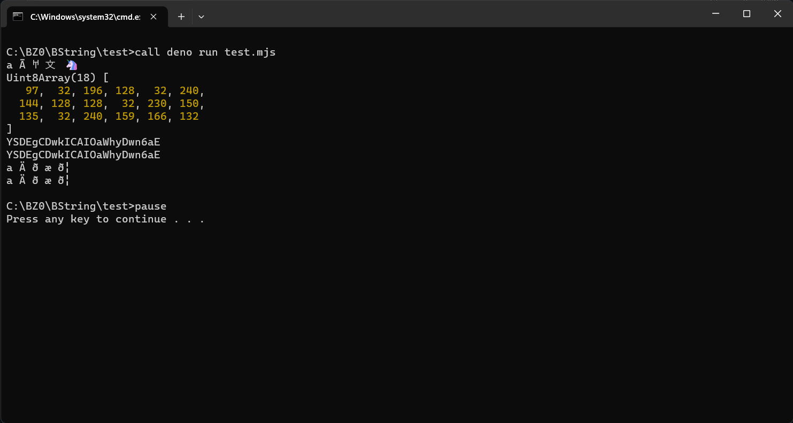

# 🔮 BString 🔮

Powerful string library, atomic, single and simple module...

## Why?

I want unify all coding or encoding methods of strings (such as UTF-8, UTF-16). I would special category for such string types.

Unfortunately around strings, around the same bits and bytes, there are many misconceptions, many possible interpretations or representations. I just want programmers (and even people) not to be confused with encodings. Yes, I was one of the first to notice a number of oddities, problems. I realized that it is time to create a library for more convenient work with encodings (especially UTF-8, and later UTF-16).

Also, there is an erroneous misconception that the number of characters equals the number of bytes. In fact, this turns out to be a fundamentally incorrect statement.

## Principles of information coding

You should always understand at least 3 input variables: the data itself, what encoding it is originally on, and what it should be transcoded to. Otherwise, it would be a complete nonsense. Unfortunately programming languages do not often explicitly specify typing by encoding (strings, bytes, etc.).

## Example of difference of encoding

Here I showing source UTF-8 string, encoded to Base64 correctly, and raw version (i.e. bytes).

- 

## Unification - time is come

### Part I - JavaScript

Already in development...

- [x] UTF-8
- [ ] UTF-16
- [x] Binary or Bytes
- [x] Base64

Also, planned...

- [ ] Full [JSOX](https://github.com/d3x0r/JSOX.git) support
- [ ] Full [Civet](https://github.com/DanielXMoore/Civet) support

What we want to do?

- [x] Cross-compatibility
- [x] Cross-conversion

### Part II - C++ and STD

Planned...

### Part III - Uncover WinAPI

Planned...
